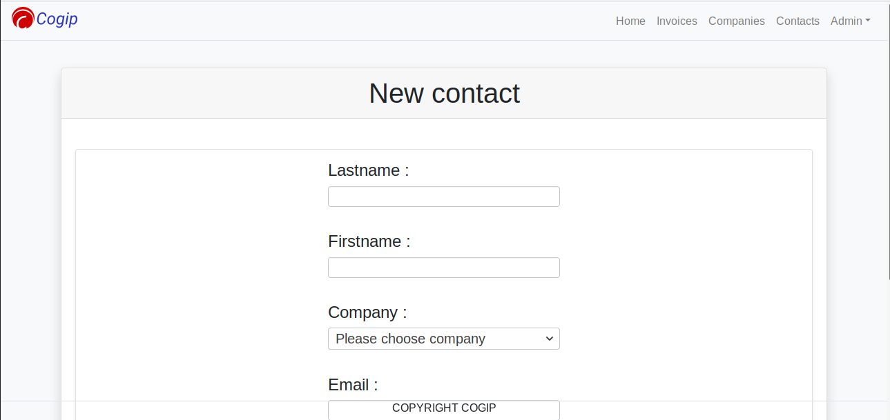
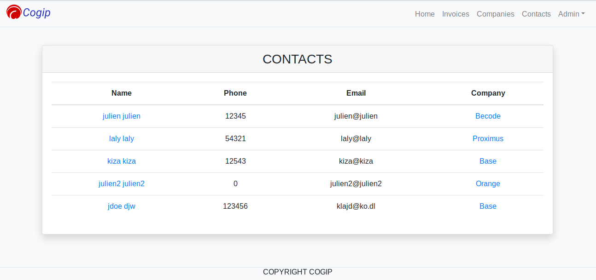
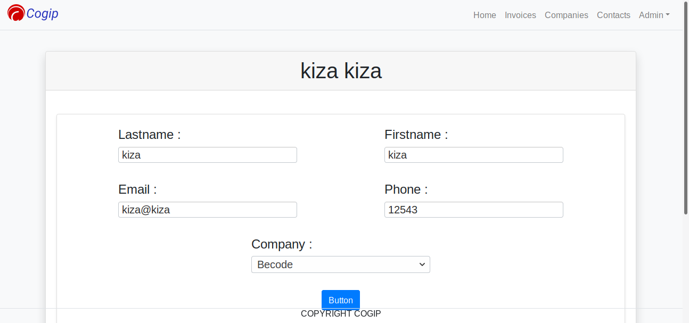

# Cogip

## Group exercise

This exercise makes us consolidate our knowledge in PHP, databases, SQL queries and collaborate + use professional development skill using the MVC structure.

The project will be evaluated on :

- [X] use of different URL parameters and filename   
- [X] use of sanitization to avoid SQL injections 
- [X] validation of data so that full-admin doesn’t input whatever 
- [X] construction of a functional relational database 
- [X] use of correct joins in SQL 
- [X] use of aliases in SQL requests
- [ ] implementation of a CRUD to read, add, modify and delete data

we should be able by the end of this challenge

- [ ] crypt password in a database 
- [X] use an MVC structure 
- [X] use a router 
- [ ] setup a session 
- [X] allow access to certain page in regards to permissions 

Team members and inputs to the projects :
Julien : part contacts
Kiza : part invoices
Laly : part companies

### Collaborators
[Julien](https://github.com/ggbjulien) 
[Kiza](https://github.com/Kiza-coder/)  
[Laly](https://github.com/lalsdev) 

## Database relations

## The mission

The account team's boss Mister Ranu from the Cogip company needs to have access to a DB which will reference all invoices made in the Cogip company, all contacts linked to the transactions, the company, the type of company which had a transaction with Cogip.

The goal is to create a system for the super user (Ranu) which will have access to all CRUD actions, the normal user (his wife) which will have the possibility to CR actions and another access for the normal user which will only have the access to the R action. 10 Days to make this project. Part of BeCode training in Web Development.

## Previews
### Create

### Read

### Update

## Methodology

Day 1:
We decide to give some time to planning the project

- Understanding how MVC works
- Creating the files organisations within our project
- Understanding what we need to make this project happen.
  - the tables needed

Day 2:

- Creating the DB
- Drawing how the tables will relate to each other
- Creating the relations with the DB using foreign keys
- Testing the database and exporting it to share it

Day 3:
- Preparing the router
- Creating the header common to all pages
- Working on displaying elements from db in the right pages
- Understanding how urls work to change pages with links
  - Global page companies + detailled page if user clicks on link (Laly)
  - Global page contacts + detailled page if user clicks on link (Kiza)
  - Global page invoices + detailled page if user clicks on link (Julien)

Day 4:
- Everyone working on their on parts (company, contacts, invoices)
    - SQL queries
    - Displaying elements on the global page
    - Displaying elements on the detailled page
- Merging all work to the development branch (Julien)
- Working on the CRUD (Create and Read) 
    - Starting to work on Insert page invoices (Kiza)
 
 
Day 5:
  - DEBUGGING a lot before we could do :
  - Inserting pages invoices, companies, contacts
  
  
Day 6:
  - Merging all work to development branch and test
  - Sanitizing inputs with Regex

Day 6:
- Merging all work to development branch and test
- Sanitizing inputs with Regex
- Adding tables to DB :
    - access
    - user
    
Day 7:
- Login page + add super-user to db (Kiza)
- Router organisation : url pages for buttons header(Kiza)
- Header and footer creation (Julien)
- Work on the CRUD (Update) Contact Page (Julien)
- Detail for providers and clients page for company part (Laly)
- Start Welcome Page (Laly)

Day 8:
- Design the pages with Bootstrap
- Looking for ways to deploy the site

Day 9 and 10 :
Trying to finish what we can.
- Permissions
- Deployment

## Tools

- HTML, CSS
- PHP
- PHP myadmin
- SQL 
- PDO method
- Docker
- Figma
- Bootstrap

## Progression
- deletion part
- sessions
- display errors
- deployment

## Credits
Made in Belgium
