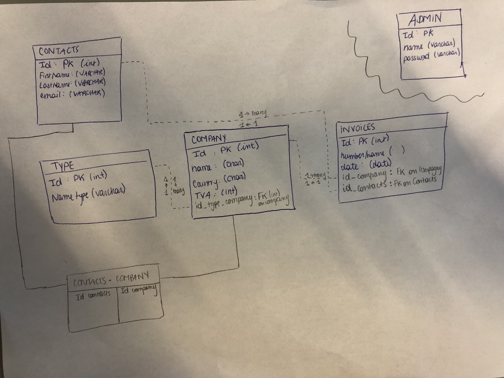

# Cogip

## Group exercise

This exercise makes us consolidate our knowledge in PHP, databases, SQL queries and collaborate + use professional development skill using the MVC structure.

The project will be evaluated on :

- use of different URL parameters and filename
- use of sanitization to avoid SQL injections
- validation of data so that full-admin doesn’t input whatever
- construction of a functional relational database
- use of correct joins in SQL
- use of aliases in SQL requests
- implementation of a CRUD to read, add, modify and delete data

we should be able by the end of this challenge

- crypt password in a database
- use an MVC structure
- use a router
- setup a session
- allow access to certain page in regards to permissions

Team members :
Julien, Kiza, Laly

## Database relations drawing

## The mission

The boss of the account team in the Cogip company needs to have access to a DB which will reference all invoices made in the Cogip company, all contacts linked to the transactions, the company, the type of company which had a transaction with Cogip.

The goal is to create a system for the super user which will have access to all CRUD actions, the normal user which will have the possibility to CR actions and another access for the normal user which will only have the access to the R action. 10 Days to make this project. Part of BeCode training in Web Development.

## Methodology

Day 1:
We decide to give some time to planning the project

- Understanding how MVC works
- Creating the files organisations within our project
- Understanding what we need to make this project happen.
  - the tables needed

Day 2:

- Creating the DB
- Drawing how the tables will relate to each other
- Creating the relations with the DB using foreign keys
- Testing the database and exporting it to share it

Day 3:
Day 4:
Day 5:
Day 6:
Day 7:
Day 8:
Day 9:
Day 10:

## Content

## Tools

- HTML, CSS
- PHP
- PHP myadmin

## Progression

## Credits

Made in Belgium
